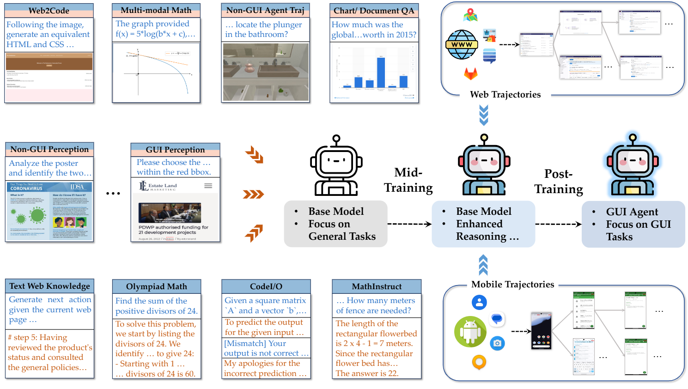
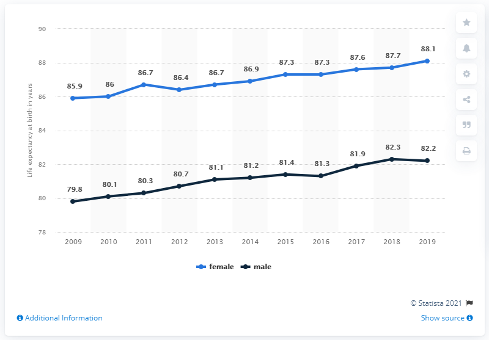
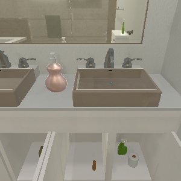
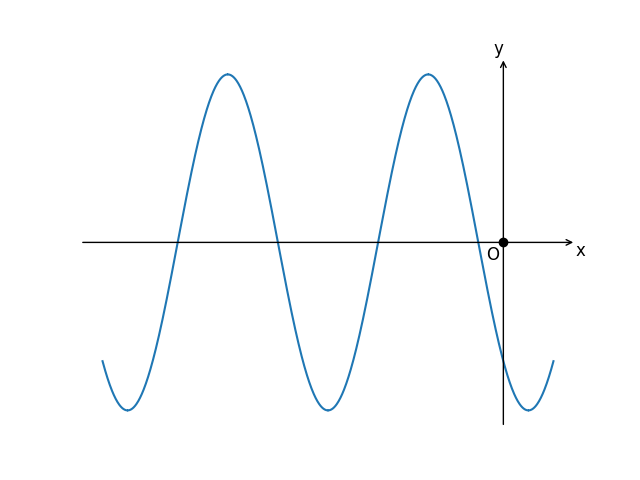

# Breaking the Data Barrier – Building GUI Agents Through Task Generalization

<div align="center">

💻 Training Code **Coming soon**   | 📝 [Paper](https://arxiv.org/abs/2504.10127) | [🤗 Mid-training Data](https://huggingface.co/datasets/hkust-nlp/GUIMid/)
</div>


## What's New
- **[2025.04.16]** 📣 Our Paper is released in [arxiv](https://arxiv.org/abs/2504.10127)!
- **[2025.04.08]** 📣 Our [Mid-training data](https://huggingface.co/datasets/hkust-nlp/GUIMid/) is released.

## Todo
- [x] Release the mid-training data and the combined MidGUI dataset
- [ ]  Paper
- [ ] Training code

## Introduction
<div align="center">

</div>


Graphical User Interface (GUI) agents' performance is often constrained by the scarcity of high-quality trajectory data. To address this limitation, we propose training Vision Language Models (VLMs) on data-rich, reasoning-intensive tasks during a dedicated mid-training stage, and then examine how incorporating these tasks in the mid-training phase facilitates generalization to GUI planning scenarios. Specifically, we explore a range of tasks with readily available instruction-tuning data, including GUI perception, multimodal reasoning, and textual reasoning. We find (1) Task generalization proves highly effective, yielding substantial improvements across most settings. For instance, multimodal mathematical reasoning enhances performance on AndroidWorld by an absolute 6.3\%. Remarkably, text-only mathematical data significantly boosts GUI web agent performance, achieving a 5.6\% improvement on WebArena and an 5.4\% improvement on AndroidWorld, underscoring notable cross-modal generalization from text-based to visual domains; (2) Contrary to prior assumptions, GUI perception data—previously considered closely aligned with GUI agent tasks and widely utilized for training—has a comparatively limited impact on final performance; (3) Building on these insights, we identify the most effective mid-training tasks and curate optimized mixture datasets, resulting in absolute performance gains of 8.0\% on WebArena and 12.2\% on AndroidWorld.

We release our mid-training data for further research.

## Data Example
<details>
<summary>Click to see the data example of each domain</summary>


| Domain       | Text                                                                 | Image                     |
|:------------:|:------------------------------------|:------------:|
| **Chart/Document QA** | What is the median value of female life expectancy at birth from 2009 to 2013?\nAnswer the question using a single word or phrase. |  |
| **Non-GUI Perception** | **User**: "The content presented in this diagram states 'SECRETARY'S REPORT ON CALL FOR APPOINTMENT FOR Dean Batson, Dr. Darby, -Chancellor Heard Who leaves Nashville on at o'clock Company or foundation: Pet Milk, Inc phone: Address: 4100 South 4th Street City: St Louis I talked with Title Made appointment with'. Read the text behind."<br>**Assistant**: "Mr. Tom Latser, Pres, Pet Fdn; Dr. Don Wilson, Mr. Boyd Schenk, Pres, Pet, Inc. whose title is 1:30 p.m. Friday Date and time of appointment: Desired Actual April 25, 1969 I confirmed the above address ( ). Instructions for getting to your appointment be Resume of conversation The appt is to held in Mr. Latzer's office at the above address. Distribution: Ozol (original) /s/ Jano Wyatt (appt made by Sue Segrest) Bruce and/or Scott Polk date Field Man Baker Source: https://www.industrydocuments.ucsf.edu/docs/ztwc0228"       |    |
| **GUI Perception**  | **User**: "Concentrate on the part of the image bordered in red, What theme does the imagery contribute to? Answer concisely with a word or phrase."<br>**Assistant**: "Outreach and generosity" |   |
| **Web Screenshot2Code** | **User**: "Analyze the visual design from the provided image and create corresponding HTML code. Supply code shaped by adherence to the foundations of material design."<br>**Assistant**: "...box-sizing: border-box;\n}\n\nbody {\n    margin: 0;\n    padding: 0;\n    font-family: Arial, sans-serif;\n}\n\n/* Banner */\n\n.banner {\n    background-color: lightgray;\n    padding: 20px;\n    text-align: center;\n}\n\n/* Search Bar */\n\n.search-bar {\n    width: 100%;\n    padding: 10px;\n}\n\n/* Sidebar */\n\n.sidebar ..." |   |
| **Non-GUI Agents** | **User**: "Given the items visible in the image, how can you plan to organize the cabinet to maximize its storage capacity and accessibility?"<br>**Assistant**: "To plan the organization of the cabinet, you should first assess the items currently stored there and their frequency of use. Items that are used more frequently, such as soap bottles and toilet paper, should be placed in easily accessible locations. Less frequently used items, such as the spray bottle and tissue box, can be stored in less accessible areas. Additionally, you can consider using storage solutions like baskets or dividers to separate items and make them easier to find. By organizing the cabinet in this way, you can maximize its storage capacity and ensure that items are easily accessible when needed" |   |
| **Multi-modal Math** | **User**: "This figure represents the graph of f(x) = 4*sin(c + pi*x/4), where c lies within the interval of (-pi, pi]. Local maximum values are achieved at f(8*k + 5)=4, where k is an integer. Taking the graph and above conditions into consideration, what does f(13/3) evaluate to?"<br>**Assistant**: "Considering that f(x) reaches its local maxima at f(8*k + 5)=4, where k is an integer, it follows that -4*sin(c + pi/4) = 4 and c + pi*(8*k + 5)/4 = 2*pi*m + pi/2, where k and m are integers, and this simplifies to c + 5*pi/4 = 2*pi*m + pi/2. As a result of solving, we have c=-3*pi/4. By plugging in the parameter values, the function becomes f(x) = -4*sin(pi*x/4 + pi/4). If we substitute x=13/3 into f(x), it results in f(13/3) = 2*sqrt(3). Thus, the value of f(13/3) is 2*sqrt(3)." |   |
| **Multi-round Visual Conversation** | **User**: "How can the presence of the small white tusks on the elephants provide insights into their age and health?"<br>**Assistant**: "The small white tusks on the elephants can be indicators of their age and health. Younger elephants typically have smaller tusks, and as they age, their tusks grow larger. Additionally..."<br> **User**:"What environmental factors might be influencing the behavior of the elephants in the image, and how can this impact their survival?"<br>**Assistant**:"The elephants in the image are gathered around a water source in a dry, rocky environment. This behavior suggests that water is a scarce resource in their habitat, and they are likely" |   |
| **MathInstruct** | **User**: "Grant scored 10 points higher on his math test than John.  John received twice as many points as Hunter who scored a 45 on his math test.  What was Grant's test score?"<br>**Assistant**: "John received twice as many points as Hunter, who received a 45 so John scored 45*2 = 90 on his test\nGrants scored 10 more points than John who got a 90 so Grant received 10+90 = 100 on his test\nThe answer is 100" | |
| **Olympiad Math** | **User**: "Prove that the sum of the squares of the lengths of the medians of a tetrahedron is equal to $4 / 9$ of the sum of the squares of the lengths of its edges."<br>**Assistant**: "To prove that the sum of the squares of the lengths of the medians of a tetrahedron is equal to $\\frac{4}{9}$ times the sum of the squares of the lengths of its edges, we will leverage the concept related to the centroid (center of mass) and moment of inertia.\n\n1. **Place Masses at Vertices**:\n   Place unit masses at the vertices of the tetrahedron..." | |
| **CODEI/O** | **User**: "You are given a question that requires some input and output variables as follows:\n\nGiven the historical fact that 1 Jan 1900 was a Monday, and considering the rules for leap years, how many Sundays fell..."<br>**Assistant**: "To predict a feasible input that results in the output `59`, we need to consider the following:\n\n1. **Leap Years**: Leap years affect the number of days in February and thus the total number of days in a year. This impacts the day of the week calculations.\n2. **Day of the Week Calculation**: Starting from 1 Jan 1900 (Monday)..." | |
| **Web Knowledge Base** | **User**: "You are given an observation of a web page, an objective and past actions, your goal is to generate the next action given the current web page\"\"\"\n# website\nwebsite = \"\"\n\n# observation of the current web page\nobservation = \"\"\"Tab 0 (current): Continental Grand Prix 4000s II Cycling Tire, Black, 700 x 25C : Sports & Outdoors\n\n[1]  'Continental Grand Prix 4000s II Cycling Tire, Black, 700 x 25C : Sports & Outdoors' focused: True\n\t[2832] link 'Click to call our Disability Customer Support line, or reach us directly at 1-888-283-1678'\n\t[2834] link 'Best Sellers'\n\t[2836] link 'Amazon Basics'\n\t[2838] link 'Customer Service'\n\t[2840] link 'New ..."<br>**Assistant**: "# step 9: Confirm the book is added to your wishlist by checking the list.\nclick(element_id=\"1251\")\n# step summary: Verify addition of book to wishlist." | |

</details>

## Results
| Domains                          | Observation       | WebArena (PR) | WebArena (SR) | AndroidWorld (SR) |
|----------------------------------|-------------------|--------------:|--------------:|------------------:|
| **GUI Post-Training Only**       | Image             | 26.3          | 6.2           | 9.0               |
| **Public Baselines**             |                   |               |               |                   |
| GPT-4o-2024-11-20                | Image             | 36.9          | 15.6          | 11.7              |
| OS-Genesis-7B                    | Image + Accessibility Tree | --       | --            | 17.4              |
| AGUVIS-72B                       | Image             | -             | -             | 26.1              |
| Claude3-Haiku                    | Accessibility Tree| 26.8          | 12.7          | -                 |
| Llama3-70b                       | Accessibility Tree| 35.6          | 12.6          | -                 |
| Gemini1.5-Flash                  | Accessibility Tree| 32.4          | 11.1          | -                 |
| **Vision-and-Language Modality** |                   |               |               |                   |
| Chart/Document QA                | Image             | 24.6          | 6.2           | 15.3              |
| Non-GUI Perception               | Image             | 28.7          | 7.6           | 14.0              |
| GUI Perception                   | Image             | 27.4          | 7.1           | 14.0              |
| Web Screenshot2Code              | Image             | 28.0          | 6.6           | 9.9               |
| Non-GUI Agents                   | Image             | 30.8          | 8.5           | 13.5              |
| Multi-modal Math ✓               | Image             | 30.4          | 8.5           | 15.3              |
| Multi-round Visual Conversation  | Image             | 30.0          | 9.0           | 12.6              |
| **Language Modality**            |                   |               |               |                   |
| MathInstruct ✓                   | Image             | 31.9          | 10.9          | 14.4              |
| Olympiad Math ✓                  | Image             | 31.5          | 8.5           | 13.1              |
| CodeI/O ✓                        | Image             | 29.2          | 9.0           | 14.9              |
| Web Knowledge Base               | Image             | 31.3          | 9.5           | 9.0               |
| **Domain Combination（domains with ✓）**           |                   |               |               |                   |
| **GUIMid**            | Image             | **34.3**      | **9.5**       | **21.2**          |

<!-- ## Citation
If you find this repository helpful, feel free to cite our paper:
```bibtex

``` -->
